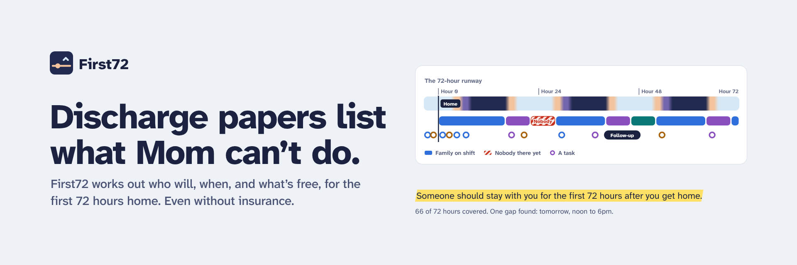

# First72

**Discharge papers list what Mom can't do. First72 works out who will, when, and what's free or cheap, even without insurance, for the first 72 hours home.**

Built for the KU hackathon challenge:

> Build a digital product that helps a family caregiver identify, obtain, and pay for the right non-clinical support during the first seventy-two hours after discharge.

Our focus: **families without insurance.** Their medical care may be done when they leave the hospital, but their recovery problems are just starting. First72 helps the caregiver arrange affordable rides, meals, household help and equipment for the first 72 hours, and connects the patient to the community healthcare and coverage they're eligible for.

**Live demo:** https://ibaadkhatib24.github.io/First72Hours/ (click "See Denise's plan")

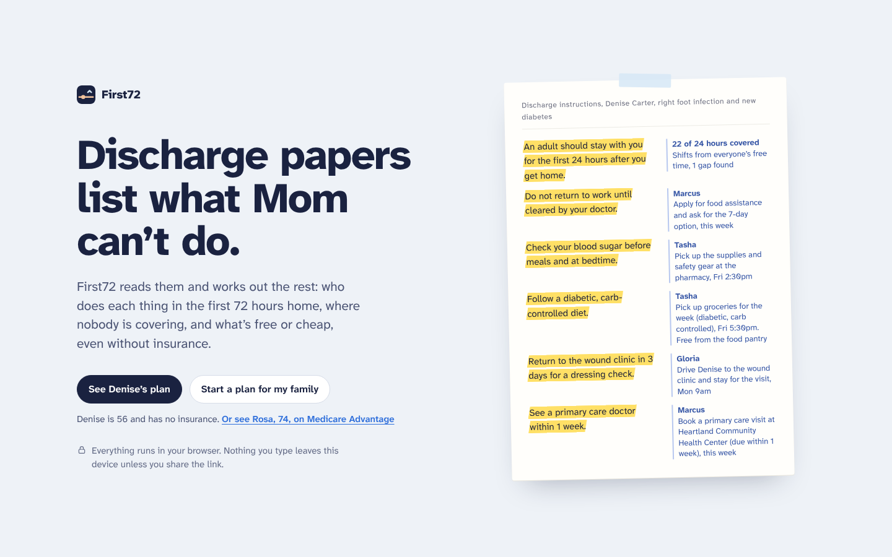

## The idea

The hospital already handled the clinical part. What the family gets is a stack of papers full of restrictions: keep weight off the foot, no driving, no work until cleared, someone has to stay with her the first night, check blood sugar four times a day. Every one of those is a job, and without insurance, every one of them also has a price.

Most tools for this are directories or checklists. First72 is a **planner**. You paste (or photograph) the discharge papers, add the people who can help, and it builds the next 72 hours:

- **Who does each task**, based on where each helper lives, whether they drive, and when they're free
- **Where nobody is covering**, hour by hour
- **What it costs, what's free, and whether that free help can start in time**
- **What the patient likely qualifies for**: charity care on the hospital bill, a sliding-fee health center, food assistance, Medicaid or a Marketplace plan
- **What could go wrong**, flagged before it does, with one plain next step for each

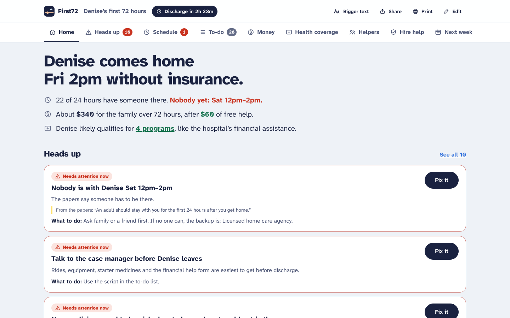

## Built for families without insurance

Denise is 56, makes about $1,700 a month at a restaurant, and has no insurance. She's going home after a foot infection and a new diabetes diagnosis. Her daughter Tasha works days, her brother Marcus lives three hours away in Wichita, and Gloria from church has mornings free.

From her papers and those few facts, First72:

- **Starts at the hospital door.** The first task is one conversation with the case manager: a ride voucher if needed, any equipment they can send home, a starter supply of the new medicines, the financial assistance application, and a referral to a community health center.
- **Gets the cash price before pickup.** Without insurance the same prescription can cost very different amounts. Marcus calls the pharmacy from Wichita before Tasha picks up.
- **Uses free help where it actually fits.** Gloria drives Denise to the wound clinic on her free morning. A food pantry covers the week's groceries. Free refurbished equipment from the Kansas Equipment Exchange takes a couple of days, so the plan says to buy the shower chair now and borrow longer-term equipment later.
- **Screens for care and coverage** using the 2026 poverty guidelines: at 128% of the poverty line she likely qualifies for the hospital's charity care, a sliding discount at Heartland Community Health Center in Lawrence, and SNAP (with the 7-day option, since she's off work). Marketplace open enrollment starts Nov 1.
- **Knows the state line matters.** Kansas hasn't expanded Medicaid, so Denise can't get KanCare. Flip the toggle to Missouri and the same Denise likely qualifies for MO HealthNet, which covers adults up to 138% of the poverty line.
- **Handles the income hit.** Off work until cleared means tasks to ask her employer about sick pay, apply for food assistance, and call 211 about rent and utility help before a bill is late.

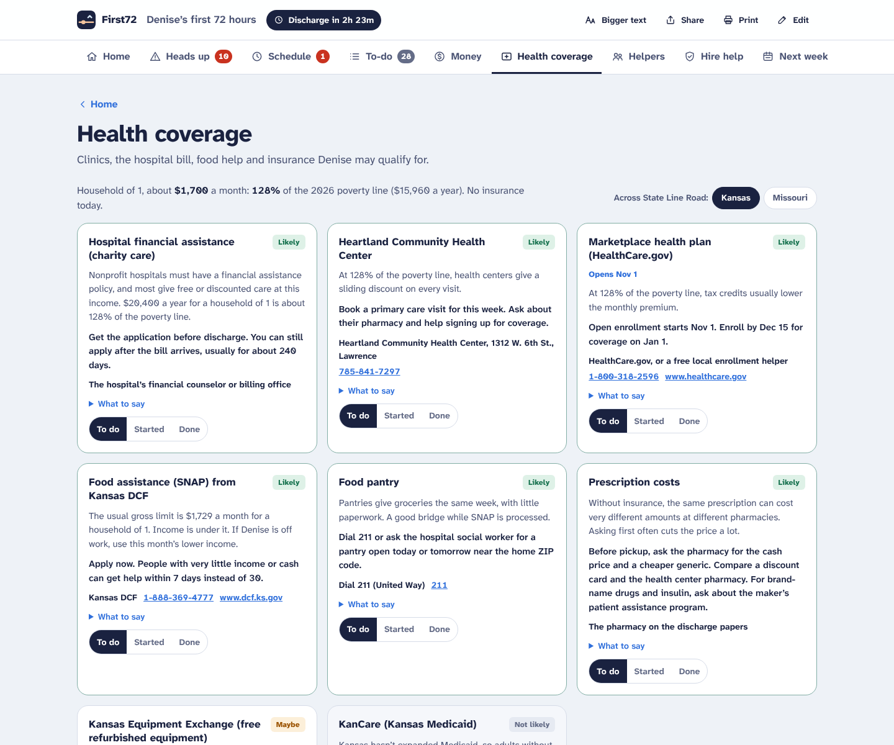

## What makes it different

### 1. Help is matched against the clock

Lots of help exists, but **each kind takes time to start**. A volunteer ride program that needs three days' notice can't get Denise home today, and a free equipment exchange that takes two days can't put a shower chair in her bathroom tonight.

First72 gives every source a lead time and checks it against when the help is actually needed:

| Need | Option | Result |
|---|---|---|
| Ride home at discharge | Tasha, who's free that afternoon | Free |
| Wound clinic visit on day 3 | Gloria has a car and free mornings | Free |
| Groceries for the week | Food pantry, ready within about 12 hours | Counted as free help |
| Shower chair and supplies tonight | Kansas Equipment Exchange (about 2 days) | **Too slow for tonight.** Buy now, borrow for the weeks ahead |
| Noon to 2pm the next day, nobody there | Friends or church (ask), or an agency | Worth asking first, agency as backup |

The same engine handles insured patients. In the Medicare Advantage example (Rosa, 74), the plan's ride benefit needs about 48 hours of notice and her follow-up is 43 hours away, so it says **too slow by an hour**, books a rideshare, and points the ride benefit at next week's physical therapy instead. It also shows what starting earlier would have saved: *"Starting this plan two days before discharge would unlock about $60 more."*

### 2. Heads up: it flags what could go wrong

Nearly 1 in 4 people have a problem after leaving the hospital, and about half of those could have been prevented or made less serious ([CMAJ](https://www.cmaj.ca/content/170/3/353)). The **Heads up** tab checks the plan for the usual trouble spots and says what to do about each one:

- **Nobody there:** hours when no one is with the patient but the papers say someone has to be
- **Medicines:** new prescriptions to pick up today, and for uninsured families, getting the cash price first so cost doesn't stop the pickup
- **Falls:** paths, night lights and the bathroom set up before the first night ([falls are a leading reason older adults go back to the hospital](https://pmc.ncbi.nlm.nih.gov/articles/PMC6632136))
- **Missed visits:** follow-ups with no family driver, or not booked yet
- **Tired caregivers:** one person carrying too many hours or nights
- **Money:** the hospital bill, lost paychecks and calls that have to happen before help can start in time

Each flag is sorted into **Needs attention now**, **Do soon** or **Keep an eye on**, shows the line from the papers behind it, and has a **Fix it** button that jumps to the exact task. Flags clear themselves as tasks get marked done. The warning-sign lines from the papers ("go to the emergency room for fever...") are pulled into a box at the top with "Emergency: call 911." First72 only copies those lines; it never gives medical advice.

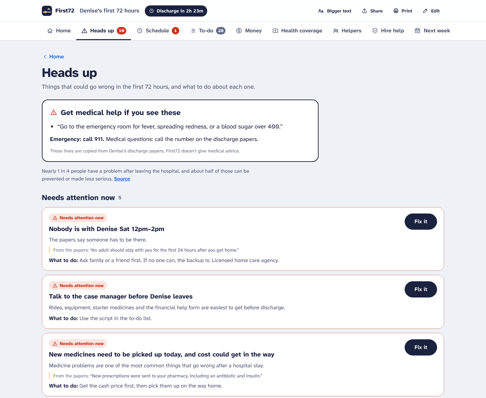

### 3. Every task cites its source

The **Discharge Decoder** reads the papers and turns each restriction into tasks. Every task shows the exact sentence that created it (or the intake answer, like "Denise lives alone"). Nothing appears without a reason, which matters when a stressed family is deciding what to skip.

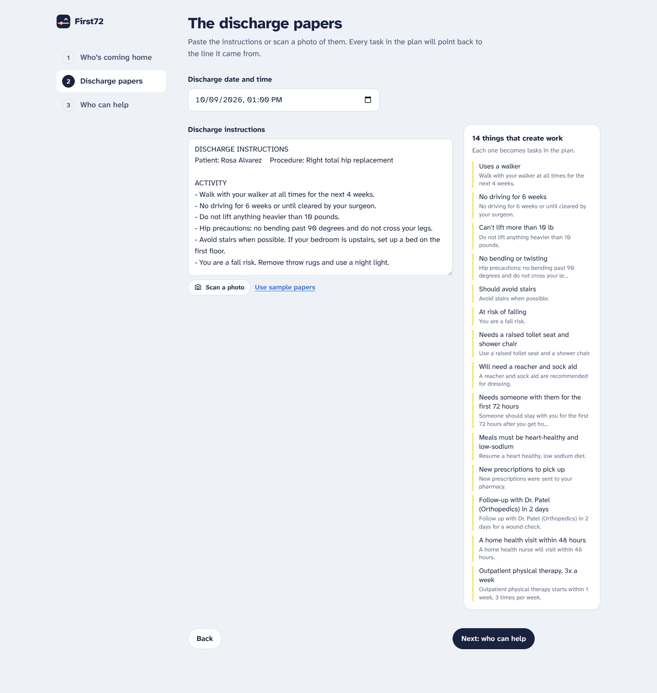

### 4. The 72-hour runway

On the **Schedule** tab, a timeline under a real sky (nights are dark, days are light) that shows who is with the patient each hour, every task as a dot, and **red hatching wherever nobody is there yet**. Mark the call that covers a gap as set up and the gap turns into booked help. Below it, the same schedule as a plain list: who's there, in order, with "Nobody yet" spelled out.

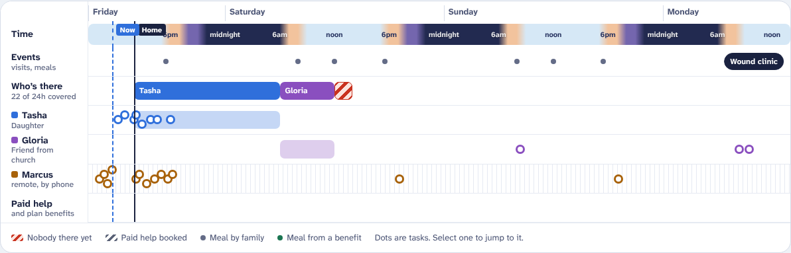

### 5. Helpers get roles by distance

People nearby take the shifts and the drives. People far away get the phone calls, applications and payments. In the sample, Marcus lives in Wichita and can't drive his sister anywhere, so he owns the case manager call, the cash-price check, the clinic booking, and the financial assistance and SNAP applications. Each person can be texted just their part.

### 6. A burnout guard for the caregiver

The plan tracks hours on duty. When one person is carrying too much (Tasha covers the first 16 hours straight, or in the Medicare example, Maya covers 42 of 72 hours including every night), it flags it, suggests a hand-off, and points to FMLA protection for the job.

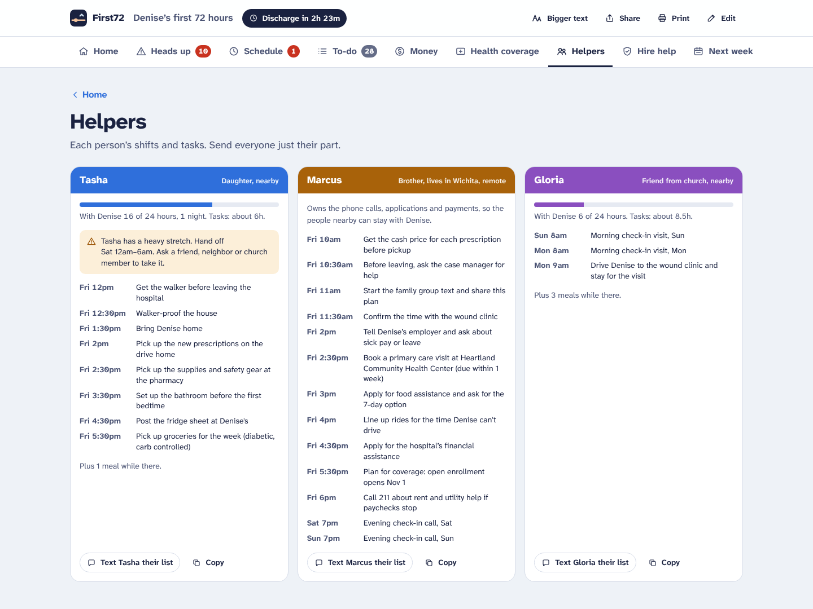

### 7. Calls with scripts, not just phone numbers

The **Money** tab is a ranked call list. Each call says when you have to call by, what it covers, what it's too slow for, and gives a word-for-word script plus what to have ready. Estimates are honest ranges, and anything that only sometimes comes through (a church volunteer, a hospital ride voucher, a plan benefit some plans have) is marked "worth asking" rather than counted.

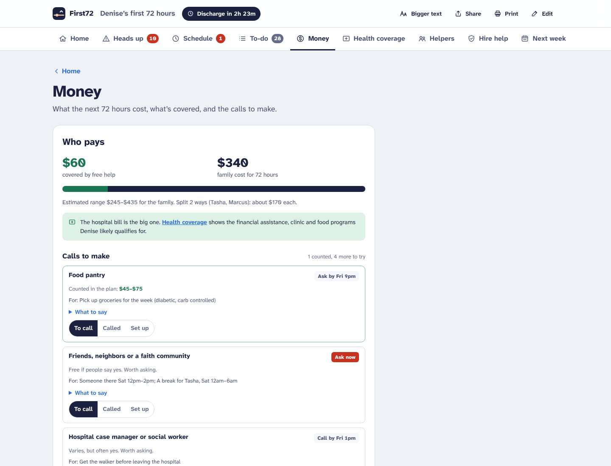

### 8. Simple enough for anyone

A caregiver might be 19 or 79, on a cracked phone in a hospital hallway. So the plan is split into one thing per page:

| Tab | What's on it |
|---|---|
| **Home** | One sentence on where things stand, the top 3 heads-up flags, the next 3 tasks and a tile for everything else |
| **Heads up** | What could go wrong and what to do |
| **Schedule** | Who is with the patient each hour |
| **To-do** | Every task in time order ("Before leaving the hospital", "Friday, discharge day"...), each marked To do, Asked or Done |
| **Money** | Costs, free help and calls to make |
| **Health coverage** | Programs the patient likely qualifies for |
| **Helpers** | Each person's part, ready to text |
| **Hire help** | Paid options, and whether they can start in time |
| **Next week** | Things to start now for after the 72 hours |

Click Helpers and you only see helpers. Every page has a "Home" link at the top, the browser's back button works, and the tabs show counts (open flags, gaps in the schedule, tasks left). A **Bigger text** button in the top bar makes everything larger, plain words replace jargon, and on a phone the top buttons keep their labels instead of turning into mystery icons.

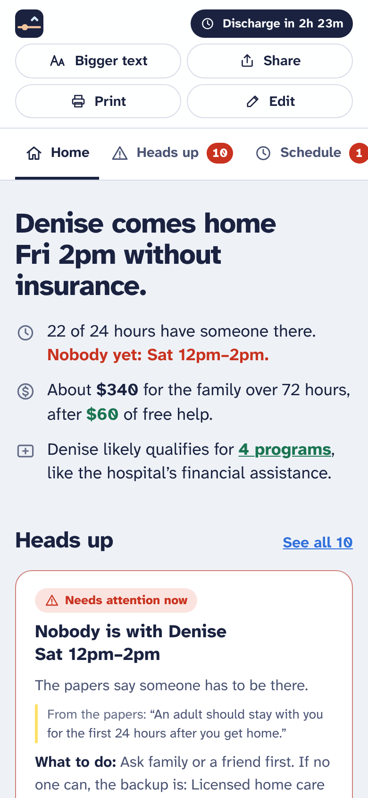

### 9. Private by design

There is no backend. The plan is computed in the browser, saved on the device, and shared by putting the whole plan in the link's `#fragment`, which browsers never send to a server. For anyone not on the group text, there's a printable **fridge sheet** with the shift table, the day's tasks and the numbers to call.

## How it covers the challenge

| Challenge | First72 |
|---|---|
| **Identify** the right support | Discharge Decoder turns papers into needs, each with a citation. Covers all 8 areas from the brief (transportation, meals, household help, appointment logistics, equipment setup, caregiver relief, family coordination, trusted providers) plus a ninth for uninsured families: care and coverage |
| **Obtain** it | Tasks assigned to specific people at specific times, round-the-clock shifts with gaps flagged, the "ask before you leave" case manager script, call scripts, per-person text messages, provider cards that show whether they can start in time, and a Heads up list that catches what could go wrong before it does |
| **Pay** for it | Free and low-cost options first (family, church, food pantry, equipment exchange, 211), lead-time checks, honest out-of-pocket ranges split across the family, and a screener for charity care, sliding-fee clinics, SNAP, Medicaid and the Marketplace |

## How it works

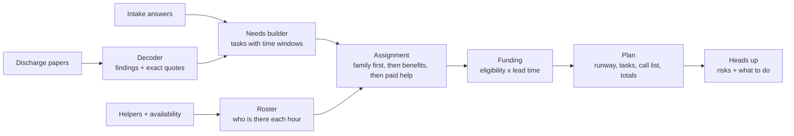

All of it lives in `src/engine`, as plain TypeScript with no UI dependencies, and it's covered by tests.

- **`decoder.ts`** finds 21 kinds of restriction and instruction (driving, lifting, supervision, equipment, diet, follow-ups, therapy, home health, supplies, time off work, warning signs and more) and keeps the sentence it read.
- **`needs.ts`** turns findings plus intake answers into tasks, each with a time window, effort, requirements (car, lifting) and what a paid service would cost.
- **`planner.ts`** builds the shift roster, assigns every task to the best person without double-booking anyone, splits meals meal by meal, finds gaps, measures each helper's load, and builds the call list.
- **`funding.ts`** has every source's eligibility rules, coverage, lead time, contact, call script and caveat.
- **`eligibility.ts`** screens for care and coverage from household size and income (2026 poverty guidelines), with Kansas and Missouri rules and local resources for Lawrence and Kansas City.
- **`flags.ts`** reviews the finished plan for risks (uncovered hours, medicines, falls, missed visits, caregiver load, money) and marks each one handled as tasks get done.
- **`share.ts`** packs the plan into a compressed link.

More detail on the rules and numbers is in [docs/HOW-IT-DECIDES.md](docs/HOW-IT-DECIDES.md). The demo script for judging is in [docs/PITCH.md](docs/PITCH.md). The palette, type, logo and banners are in [docs/BRAND.md](docs/BRAND.md).

## Run it

```bash
npm install
npm run dev      # http://localhost:5173
npm test         # engine tests
npm run build    # production build in dist/
```

Requires Node 20 or newer.

## Deploy

The repo includes a GitHub Actions workflow that tests, builds and publishes to GitHub Pages on every push to `main`. One-time setup: **Settings → Pages → Build and deployment → Source: GitHub Actions**.

## Project structure

```
src/
  engine/        planning engine (no React), with tests
  components/    Start, Intake, PlanView (tabs), Home, HeadsUpList, Runway, Ledger, WhoPays,
                 CareCoverage, CrewCards, Providers, Fridge
  ui/            formatting, messages, view helpers
  styles/        one stylesheet with light and dark tokens
docs/            pitch script, decision rules, brand kit, screenshots
```

## Honest limits and what's next

- **The screener is a screener.** Programs make the final call, and Kansas City area resources are built in while other areas fall back to national finders (HRSA health centers, 211, HealthCare.gov).
- **The decoder is rule-based**, tuned for common English discharge phrasing. Next step is an LLM second pass under the same citation rule: any need it suggests has to quote a line from the papers or it's dropped.
- **Costs are Kansas City area estimates.** The scripts ask the questions that confirm real prices, and "maybe" help is never counted in the totals.
- **Provider cards are sample listings.** In production they'd come from state license records, and the "can start in time" check would use real availability.
- **Sharing is a snapshot link**, not live sync. Optional end-to-end encrypted sync would let helpers check off tasks for everyone.
- **Best time to start is admission, not discharge.** A hospital case manager could start the plan on day one, which unlocks more benefits.

First72 plans non-clinical help only and does not give medical advice.

## Sources

For the heads-up flags:

- [Baker and Norton, "Adverse events and patient safety in Canadian health care," CMAJ 2004](https://www.cmaj.ca/content/170/3/353) (nearly a quarter of discharged patients had an adverse event, about half preventable or ameliorable)
- [Hoffman et al., "Posthospital Fall Injuries and 30-Day Readmissions in Adults 65 Years and Older," JAMA Network Open 2019](https://pmc.ncbi.nlm.nih.gov/articles/PMC6632136) (fall injuries were the third most common reason for readmission)

For the funding and eligibility rules:

- [2026 HHS poverty guidelines (via USAC)](https://www.usac.org/2026-federal-poverty-guidelines-for-survivors-applying-to-lifeline/) ($15,960 for one person, plus $5,680 per additional person)
- [HRSA: health center sliding fee discount program](https://bphc.hrsa.gov/es/node/1789) (full discount at or below 100%, sliding to 200%, no one turned away for inability to pay)
- [IRS: hospital financial assistance policies, Section 501(r)(4)](https://www.irs.gov/charities-non-profits/financial-assistance-policy-and-emergency-medical-care-policy-section-501r4) and [billing and collections, 501(r)(6)](https://www.irs.gov/charities-non-profits/billing-and-collections-section-501r6)
- [Kansas Medicaid status (healthinsurance.org, updated Sept 2026)](https://www.healthinsurance.org/medicaid/kansas/) (no expansion, no coverage for adults without children)
- [Missouri Medicaid income limits](https://checkmedicaid.com/missouri-medicaid-income-limits/) (adults 19 to 64 up to 138% of the poverty line)
- [Marketplace deadlines for 2027 coverage](https://healthcareinsider.com/faq-health-insurance-marketplace-deadlines-for-2027-coverage) (Nov 1, 2026 to Jan 15, 2027)
- [Kansas DCF food assistance brochure](https://www.dcf.ks.gov/services/ees/Documents/Food/ES-2007_food_asst_brochure.pdf) (help within 7 days for very low income, 1-888-369-4777)
- [Kansas Equipment Exchange, Assistive Technology for Kansans](https://atk.ku.edu/2025-kansas-equipment-exchange-kee-reuse) (free refurbished equipment)
- [Heartland Community Health Center](https://lplks.org/content/heartland-community-health-center) (Lawrence, sliding scale, 785-841-7297) and [JayDoc Free Clinic](https://www.kumc.edu/school-of-medicine/patient-care/student-run-clinics/jaydoc-free-clinic/about.html) (Kansas City, KS)

- [Medicare: walker coverage](https://www.medicare.gov/coverage/walkers) (Part B equipment, 20% after the deductible, enrolled suppliers)
- [CMS: 2026 Medicare Parts A & B premiums and deductibles](https://www.cms.gov/newsroom/fact-sheets/2026-medicare-parts-b-premiums-deductibles) ($283 Part B deductible)
- [Example Medicare Advantage post-discharge meal benefit](https://cityofny.aetnamedicare.com/added-benefits-and-wellness/extra-benefits/meals-home) (14 meals over 7 days, starting within about 48 hours)
- [Kansas Aging & Disability Resource Center](https://kdads.ks.gov/services-programs/aging-and-disability-resource-center) (855-200-2372)
- [Family Caregiver Alliance: Kansas resources](https://www.caregiver.org/connecting-caregivers/services-by-state/kansas/) (Eldercare Locator, respite, Frail Elderly waiver)
- [KDADS: paying for respite](https://www.kdads.ks.gov/services-programs/long-term-services-supports/ltss-training-resources/respite-for-caregivers/paying-for-respite) (VA respite up to 30 days a year, VA Caregiver Support Line 855-260-3274)

## License

MIT
