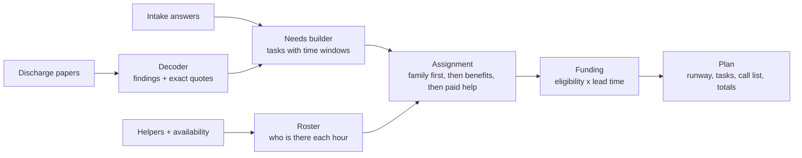

# First72

**Discharge papers list what Mom can't do. First72 works out who will, when, and who pays, for the first 72 hours home.**

Built for the KU hackathon challenge:

> Build a digital product that helps a family caregiver identify, obtain, and pay for the right non-clinical support during the first seventy-two hours after discharge.

**Live demo:** https://ibaadkhatib24.github.io/First72Hours/ (click "See Rosa's plan")


## The idea

The hospital already handled the clinical part. What the family gets is a stack of papers full of restrictions: no driving for 6 weeks, nothing over 10 pounds, someone must stay with her for 72 hours. Every one of those is a job somebody has to do, and most of them start the moment the car pulls into the driveway.

Most tools for this are directories or checklists. First72 is a **planner**. You paste (or photograph) the discharge papers, add the people who can help, and it builds the next 72 hours:

- **Who does each task**, based on where each helper lives, whether they drive, and when they're free
- **Where nobody is covering**, hour by hour
- **Which benefits pay for it, and whether they can start in time**


## What makes it different

### 1. Benefits are matched against the clock

This is the core insight. Lots of help exists (Medicare Advantage meals and rides, Medicaid rides, employer backup care, Area Agency on Aging programs, VA respite) but **each one takes time to start**. A ride benefit that needs 48 hours of notice is useless for a follow-up that's 43 hours away.

First72 gives every funding source a lead time and checks it against when the help is actually needed. In the sample plan:

| Need | Best benefit | Result |
|---|---|---|
| Ride to Dr. Patel at Hour 43 | Medicare Advantage rides (about 48h notice) | **Too slow by an hour.** Plan books a rideshare and tells you so |
| Rides to physical therapy next week | Same ride benefit | **Perfect fit.** It goes to the top of the call list |
| Meals | Plan meals start about 2 days after you ask | Family cooks days 1 and 2, plan meals take over after |
| Saturday afternoon with nobody there | Backup care through Maya's job (1 day notice) | Covered at 80%, booked by tomorrow |
| Home-delivered meals (Older Americans Act) | Intake and waitlist | Too slow for this week, so it's in "Start now for next week" |

It even calculates what starting earlier would have saved: *"Starting this plan two days before discharge would unlock about $60 more."* That's the pitch to hospitals: hand this out at admission, not at discharge.

### 2. Every task cites its source

The **Discharge Decoder** reads the papers and turns each restriction into tasks. Every task shows the exact sentence that created it (or the intake answer, like "Rosa lives alone"). Nothing appears without a reason, which matters when a stressed family is deciding what to skip.


### 3. The 72-hour runway

A timeline under a real sky (nights are dark, days are light) that shows who is with the patient each hour, every task as a dot, and **red hatching wherever nobody is there yet**. Mark the backup care call as set up and the gap turns into booked help.


### 4. Helpers get roles by distance

People nearby take the shifts and the drives. People far away get the phone calls, online orders and payments. In the sample, Dev lives in Denver and can't drive his mom anywhere, so he owns ordering the safety kit, booking physical therapy and confirming the appointment. Each person can be texted just their part.

### 5. A burnout guard for the caregiver

The plan tracks hours on duty. When one person is carrying too much (Maya covers 42 of 72 hours, including every night), it flags it, books a hand-off, and points to FMLA protection for her job.


### 6. Calls with scripts, not just phone numbers

"Who pays" is a ranked call list. Each call says when you have to call by, what it covers, what it's too slow for, and gives a word-for-word script plus what to have ready. Estimates are honest ranges, and anything that only some plans include is marked "worth asking" rather than counted.


### 7. Private by design

There is no backend. The plan is computed in the browser, saved on the device, and shared by putting the whole plan in the link's `#fragment`, which browsers never send to a server. For anyone not on the group text, there's a printable **fridge sheet** with the shift table, the day's tasks and the numbers to call.

## How it covers the challenge

| Challenge | First72 |
|---|---|
| **Identify** the right support | Discharge Decoder turns papers into needs, each with a citation. Covers all 8 areas from the brief: transportation, meals, household help, appointment logistics, equipment setup, caregiver relief, family coordination, trusted providers |
| **Obtain** it | Tasks assigned to specific people at specific times, round-the-clock shifts with gaps flagged, call scripts, per-person text messages, provider cards that show whether they can start in time |
| **Pay** for it | Funding stack per need (insurance, programs, employer, community, out of pocket), lead-time checks, HSA/FSA flags, family split, and the "start earlier" bonus |

## How it works



All of it lives in `src/engine`, as plain TypeScript with no UI dependencies, and it's covered by tests.

- **`decoder.ts`** finds 18 kinds of restriction (driving, lifting, supervision, equipment, diet, follow-ups, therapy, home health and more) and keeps the sentence it read.
- **`needs.ts`** turns findings plus intake answers into tasks, each with a time window, effort, requirements (car, lifting) and what a paid service would cost.
- **`planner.ts`** builds the shift roster, assigns every task to the best person without double-booking anyone, splits meals meal by meal, finds gaps, measures each helper's load, and builds the call list.
- **`funding.ts`** has every source's eligibility rules, coverage, lead time, contact, call script and caveat.
- **`share.ts`** packs the plan into a compressed link.

More detail on the rules and numbers is in [docs/HOW-IT-DECIDES.md](docs/HOW-IT-DECIDES.md). The demo script for judging is in [docs/PITCH.md](docs/PITCH.md).

## Run it

```bash
npm install
npm run dev      # http://localhost:5173
npm test         # engine tests
npm run build    # production build in dist/
```

Requires Node 20 or newer.

## Deploy

The repo includes a GitHub Actions workflow that tests, builds and publishes to GitHub Pages on every push to `main`. One-time setup: **Settings → Pages → Build and deployment → Source: GitHub Actions**.

## Project structure

```
src/
  engine/        planning engine (no React), with tests
  components/    Start, Intake, PlanView, Runway, Ledger, WhoPays, CrewCards, Providers, Fridge
  ui/            formatting, messages, view helpers
  styles/        one stylesheet with light and dark tokens
docs/            pitch script, decision rules, screenshots
```

## Honest limits and what's next

- **The decoder is rule-based**, tuned for common English discharge phrasing. Next step is an LLM second pass under the same citation rule: any need it suggests has to quote a line from the papers or it's dropped.
- **Costs are Kansas City area estimates** and benefits vary by plan. That's why the scripts ask the questions that confirm them, and "some plans" benefits are never counted in the totals.
- **Provider cards are sample listings.** In production they'd come from state license records, and the "can start in time" check would use real availability.
- **Sharing is a snapshot link**, not live sync. Optional end-to-end encrypted sync would let helpers check off tasks for everyone.
- **Best time to start is admission, not discharge.** A hospital case manager could start the plan on day one, which unlocks more benefits.

First72 plans non-clinical help only and does not give medical advice.

## Sources for the funding rules

- [Medicare: walker coverage](https://www.medicare.gov/coverage/walkers) (Part B equipment, 20% after the deductible, enrolled suppliers)
- [CMS: 2026 Medicare Parts A & B premiums and deductibles](https://www.cms.gov/newsroom/fact-sheets/2026-medicare-parts-b-premiums-deductibles) ($283 Part B deductible)
- [Example Medicare Advantage post-discharge meal benefit](https://cityofny.aetnamedicare.com/added-benefits-and-wellness/extra-benefits/meals-home) (14 meals over 7 days, starting within about 48 hours)
- [Kansas Aging & Disability Resource Center](https://kdads.ks.gov/services-programs/aging-and-disability-resource-center) (855-200-2372)
- [Family Caregiver Alliance: Kansas resources](https://www.caregiver.org/connecting-caregivers/services-by-state/kansas/) (Eldercare Locator, respite, Frail Elderly waiver)
- [KDADS: paying for respite](https://www.kdads.ks.gov/services-programs/long-term-services-supports/ltss-training-resources/respite-for-caregivers/paying-for-respite) (VA respite up to 30 days a year, VA Caregiver Support Line 855-260-3274)

## License

MIT
