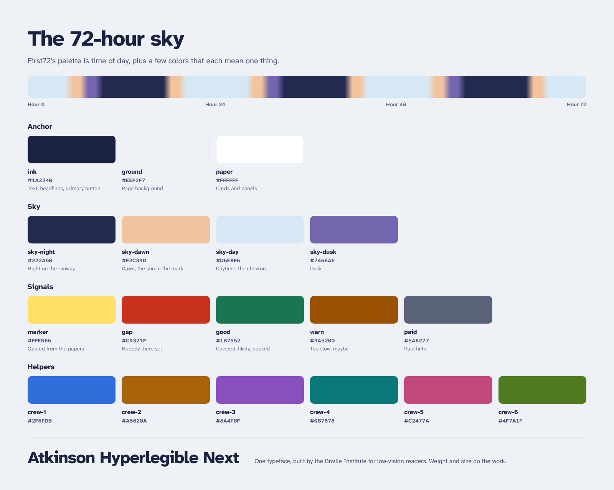

# First72 brand

First72 should feel calm, specific and practical. It speaks from the caregiver's side of the kitchen table and never looks like a hospital. Every color, size and file below matches the app (`src/styles/app.css`).

## The 72-hour sky

The palette is time of day. The night, dawn, day and dusk colors draw the runway sky. Navy is the anchor, and every other color means one thing.

| Token | Light | Dark | Use |
|---|---|---|---|
| `ink` | `#1A2240` | `#EEF1FA` | Text, headlines, primary button fill |
| `ground` | `#EEF2F7` | `#10152C` | Page background |
| `paper` | `#FFFFFF` | `#181E3C` | Cards and panels |
| `ink-2` | `#4B5474` | `#B9C0DA` | Secondary text |
| `ink-3` | `#646C87` | `#8A93B3` | Hints, counts, legends |
| `line` | `#D6DCE8` | `#333C66` | Borders and hairlines |
| `sky-night` | `#222A50` | same | Night on the runway |
| `sky-dawn` | `#F2C39D` | same | Dawn and late afternoon, the sun in the mark |
| `sky-day` | `#D6E8F6` | same | Daytime, the chevron in the mark |
| `sky-dusk` | `#7466AE` | same | Dusk |
| `marker` | `#FFE066` | `#8A7414` | Only behind words quoted from the discharge papers |
| `gap` | `#C9321F` | `#FF7461` | Nobody there yet, no owner, call now |
| `good` | `#1B7552` | `#55D39F` | Covered, likely, booked |
| `warn` | `#9A5200` | `#FFB54D` | Too slow, heavy load, maybe |
| `paid` | `#5A6277` | `#A4ACC4` | Paid help and services |
| `focus` | `#2F6FDB` | `#84AEFF` | Focus ring and links |
| `crew-1` to `crew-6` | `#2F6FDB` `#A8620A` `#8A4FBF` `#0B7878` `#C2477A` `#4F7A1F` | same | One color per helper, everywhere |

Rules:

- Sky colors never hold text.
- Signal colors always come with a word ("Nobody", "Likely", "Too slow"), never color alone.
- Uncovered time is a hatch of `gap` on `gap-soft` (`#FBE4DF`), not a flat red.
- Text pairs meet 4.5:1 in both themes.

## Type

One family: **Atkinson Hyperlegible Next** (weights 200 to 800), built by the Braille Institute for low-vision readers. The app ships it through `@fontsource-variable/atkinson-hyperlegible-next`.

| Style | Size / line height | Weight | Use |
|---|---|---|---|
| Display | 68px / 1.02, -0.03em | 780 | Start headline and banners |
| Summary | 32px / 1.3 | 500 | The plan's one-sentence summary |
| Section | 26px / 1.25 | 760 | Section headings |
| Heading | 19px / 1.3 | 760 | Card and category titles |
| Body | 17px / 1.5 | 400 | Running text (16px on phones) |
| Small | 15px / 1.45 | 400 | Citations and notes |
| Label | 14px / 1.3 | 700 | Chips, deadlines, compact buttons |

## Logo

- `brand/first72-mark.svg` is the app mark: a horizon line with the sun on it and an upward chevron, for the first morning home. It's also the favicon.
- `brand/first72-lockup.png` is for light grounds. `brand/first72-lockup-on-dark.png` is for dark grounds.
- Keep clear space of a quarter of the mark's width. Don't go below 24px. Don't recolor it or add a cross, heart or stethoscope.

## Banners

| File | Size | Use |
|---|---|---|
| `brand/first72-banner-hero-1920x640.png` | 1920 × 640 | Website hero, top of this README |
| `brand/first72-banner-social-1280x640.png` | 1280 × 640 | GitHub social preview, link previews |
| `brand/first72-banner-social-night-1280x640.png` | 1280 × 640 | Dark sites and slides |
| `brand/first72-banner-wide-1584x396.png` | 1584 × 396 | Devpost, LinkedIn, wide headers |

To use the social banner as the repo's link preview, go to **Settings → General → Social preview** and upload `first72-banner-social-1280x640.png`.

## Voice

- Use short sentences, plain verbs and sentence case. No exclamation marks, no emoji.
- Name the person, the time and the thing. "Gloria drives Denise to the wound clinic, Mon 9am."
- Money is a range. Help that might come through is "worth asking", never counted.
- Never give medical advice. Point to the number on the discharge papers, and 911 in an emergency.

## Why this palette

Care brands pair a trusted navy or blue with one warm accent. The National Alliance for Caregiving uses deep blue and orange, and Zocdoc dropped clinical blues for optimistic yellow. One Medical shows that a few restrained colors read as trust. First72 keeps the navy and warmth, but gives every color a job. No other health brand uses time of day as its palette, and the runway sky makes the first 72 hours visible.

Sources: [One Medical brand guidelines](https://www.onemedical.com/brand-guidelines/), [Design Week on Zocdoc](https://www.designweek.co.uk/how-wolff-olins-aims-to-make-zocdoc-the-face-of-healthcare-literally/), [Bond on Papa](https://legacy.bond-agency.com/project/papa), [Constructive on the National Alliance for Caregiving](https://constructive.co/insight/branding-and-visual-identity-systems-change-national-alliance-for-caregiving/), [PharmExec on trust through design](https://pharmexec.com/view/healthcare-visual-future-shaping-trust-through-design).
